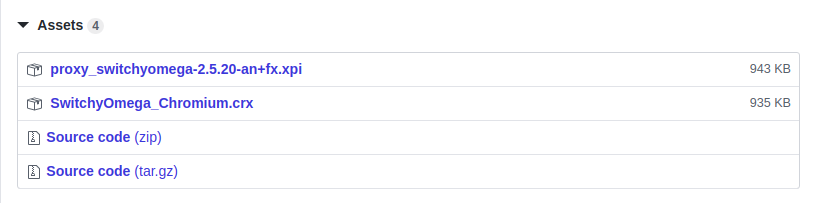
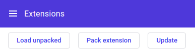
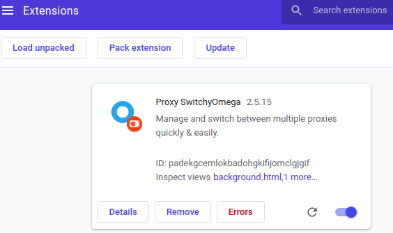
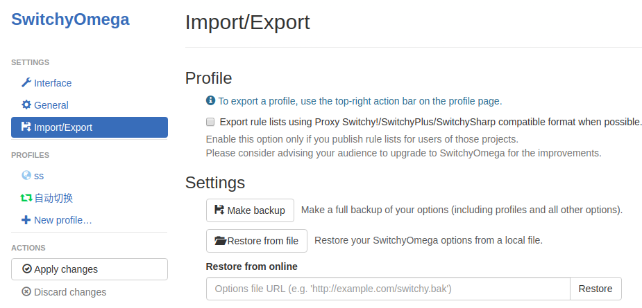

### SwitchyOmega的下载、安装、配置说明

#### 0. 简述

在安装Google Chrome之后，通过v2ray工具，进行配置，但是需要使用SwitchyOmega来管理和切换多个代理设置；

#### 1. 下载 

插件文件名：Proxy-SwitchyOmega-Chromium-2.5.15.crx

插件下载地址：https://github.com/FelisCatus/SwitchyOmega/releases

从这个网址相对靠前的位置，找到相对较新的版本，如：SwitchyOmega 2.5.20 for Chromium & Firefox，下载SwitchyOmega插件，有分别支持Google Chrome和FireFox的插件；目前个人只用到了Google Chrome，所以在这里就只写Google Chrome添加SwitchyOmega插件的方法；

选中第二项，SwitchyOmega-Chromium.crx，并下载；

#### 2. 安装

在Google Chrome浏览器的地址栏输入：chrome://extensions/，回车后打开扩展程序页面；或者点击浏览器右上角的配置（竖向三个点），点击“Settings”，选择“Extensions”，也可以打开扩展程序页面；

在扩展程序页面，无法直接将下载的crx文件拖进来安装，需要将Proxy-SwitchyOmega-Chromium-2.5.15.crx的后缀名.crx改为.zip，即：Proxy-SwitchyOmega-Chromium-2.5.15.zip；并将zip压缩文件解压到目录中；

在扩展程序页面的右上角，找到“Developer mode”（开发者模式），打开开关，页面左上角会出现“Load unpacked”（加载已解压程序）;

点击“Load unpacked”，在弹出的文件系统中，找到Proxy-SwitchyOmega-Chromium-2.5.15.zip的解压路经；选择解压后的目录，就在Google Chorme中添加成功了；

此时，在Google Chrome页面的地址栏右侧，会出现一个黑色圆环，表示SwitchyOmega插件已经安装成功；

#### 3. 配置

在Google Chrome页面的地址栏右侧，有个黑色圆环，右键点击，选择“Options”选项；在打开的页面中，选择“Import/Export”，在页面中间的“Settings”中选择“Restore from file”，在文件系统中，找到SwitchyOmegaOption文件，并选中；导入配置成功；

左键点击地址栏右侧的黑色圆环，选择“自动切换”，之后，黑色圆环变成彩色；

在扩展程序页面的右上角，找到“Developer mode”（开发者模式），关闭开关；添加SwitchyOmega并配置完成，可以正常使用；